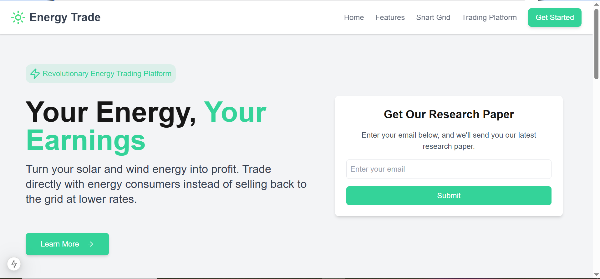

⚡ P2P Energy Trading DApp (Solana + Next.js)
🚀 A decentralized energy trading platform on the Solana blockchain using Phantom Wallet for peer-to-peer transactions.

[screen](Capture1.PNG) 

🌟 Features
✅ Decentralized Energy Trading – Trade renewable energy credits securely
✅ Phantom Wallet Integration – Connect and trade using Solana blockchain
✅ Real-Time Transaction Updates – View latest trades with live pricing
✅ Modern UI (Tailwind + Glassmorphism) – Sleek, responsive, and futuristic design
✅ Live Pricing System – Energy cost updates dynamically (₹2 - ₹9 per kWh)

🔧 Tech Stack
Frontend: Next.js (React), Tailwind CSS
Blockchain: Solana, Solana Web3.js
Wallet: Phantom Wallet Adapter
State Management: React Hooks
Deployment: Vercel / Netlify
🚀 Installation & Setup
1️⃣ Clone the Repository
sh
Copy
Edit
git clone https://github.com/kartik010/p2p-energy-trading.git
cd p2p-energy-trading
2️⃣ Install Dependencies
sh
Copy
Edit
npm install
3️⃣ Configure Solana Devnet
Ensure your Solana CLI is configured for Devnet:

sh
Copy
Edit
solana config set --url https://api.devnet.solana.com
4️⃣ Start the Development Server
sh
Copy
Edit
npm run dev
📌 Visit: http://localhost:3000

📂 Project Structure
bash
Copy
Edit
/p2p-energy-trading
│── /public         # Static assets (icons, images)
│── /src
│   ├── /app
│   │   ├── /components  # Reusable UI components (Navbar, Features, Cards)
│   │   ├── /trade       # Trade Page (Main DApp UI)
│   │   ├── /api         # API Routes for trade processing
│   │   ├── /providers   # Solana Wallet Provider
│   │   ├── layout.tsx   # Root Layout (Includes WalletProvider)
│   │   ├── globals.css  # Global Styles
│── package.json        # Dependencies & Scripts
│── tailwind.config.js  # Tailwind Custom Theme
│── README.md           # Project Documentation
🔥 How to Use
1️⃣ Connect Phantom Wallet (Click "Connect Wallet")
2️⃣ Enter Energy (kWh) to Trade
3️⃣ See Dynamic Pricing (₹2 - ₹9 per kWh)
4️⃣ Click "Sell Energy" to execute a trade
5️⃣ View Transactions in History (Linked to Solana Explorer)

🔗 Important Links
🌐 Live Demo: https://your-app-url.com (Replace with your Vercel/Netlify link!)
📜 Solana Devnet Faucet: https://faucet.solana.com (Get free test SOL for trading!)
📖 Next.js Docs: https://nextjs.org/docs
💰 Phantom Wallet: https://phantom.app
